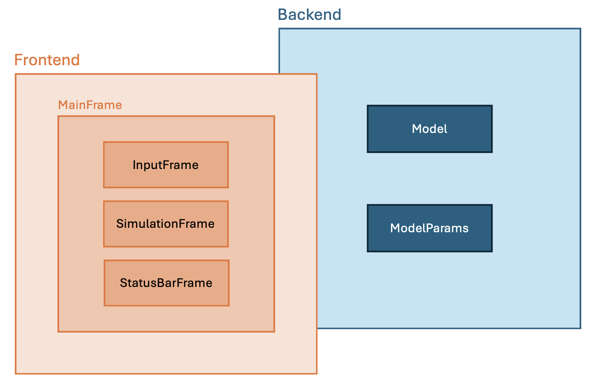

# System Design

The system is structured into two main layers: the **frontend**, which serves as the interface between the user and the
application’s functionality, and the **backend**, which handles the core logic and data management of the application.

    
    
<b>Figure 1:</b> System design.

## Frontend:

### Graphical User Interface (GUI)

The frontend is represented by the GUI (Graphical User Interface), which serves as the point of interaction between the
user and the application. It is responsible for presenting the user interface and managing user interactions. The GUI
is structured in a main class called [**MainFrame**](../src/mu_teg_sim/gui/main_frame.py) and three other classes:
[**InputFrame**](../src/mu_teg_sim/gui/input_frame.py),
[**SimulationFrame**](../src/mu_teg_sim/gui/simulation_frame.py),
and [**StatusBarFrame**](../src/mu_teg_sim/gui/status_bar_frame.py). These classes are instantiated in the main
class to form the user interface.

- [**MainFrame**](../src/mu_teg_sim/gui/main_frame.py): The main container for the GUI application. It initializes
  and manages the overall layout of the application, including the integration of the InputFrame, SimulationFrame, and
  StatusBarFrame. This class handles the main application window, user events, and overall user interface management. It
  also interacts with the [**ModelParams**](../src/mu_teg_sim/model/model_params.py) class from the backend,
  serving as a bridge between the frontend and backend components.

- [**InputFrame**](../src/mu_teg_sim/gui/input_frame.py): Handles user input for model parameters. This class
  provides fields for parameter entry and includes buttons for resetting, saving, and loading parameters.

- [**SimulationFrame**](../src/mu_teg_sim/gui/simulation_frame.py): Manages the execution of simulations and the
  display of results. This class provides controls to run simulations, clear results, save outputs, and adjust
  visualization settings such as axis scaling. It interacts with the [**Model**](../src/mu_teg_sim/model/model.py)
  class from the backend, acting as a bridge between the frontend and backend. Specifically, each time the user
  initiates a simulation, an instance of the [**Model**](../src/mu_teg_sim/model/model.py) class is created as an
  attribute within this frame.

- [**StatusBarFrame**](../src/mu_teg_sim/gui/status_bar_frame.py): Handles real-time status updates and
  notifications related to the simulation process, including error messages and alerts.

## Backend

The backend is responsible for the core functionality and logic of the application. It includes two classes:

- [**Model**](../src/mu_teg_sim/model/model.py): Encapsulates the core logic for running simulations. This class
  includes methods for performing calculations, processing input parameters, and generating results based on the model
  physics. It interacts with the instance of [**ModelParams**](../src/mu_teg_sim/model/model_params.py) class
  instantiated in the [**MainFrame**](../src/mu_teg_sim/gui/main_frame.py) to retrieve and validate the necessary
  parameters.

- [**ModelParams**](../src/mu_teg_sim/model/model_params.py): Manages the data structure for parameter storage,
  validation, and file operations. This class includes methods for loading parameters from files, saving parameters to
  files, and validating parameter values according to predefined criteria.
